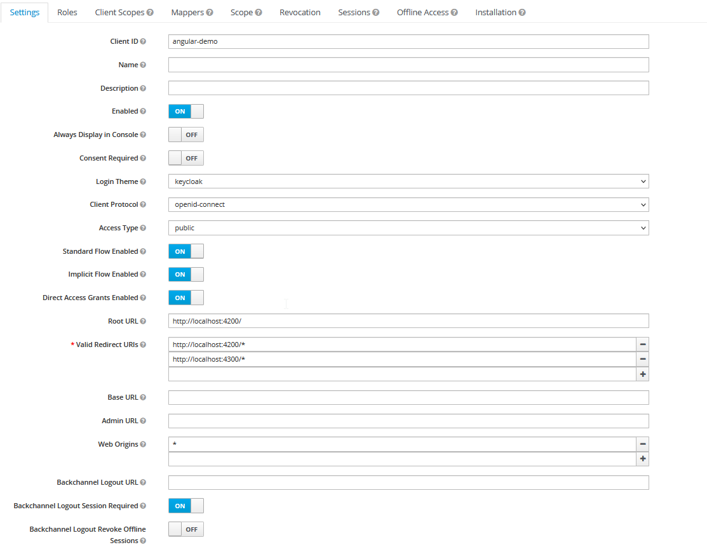
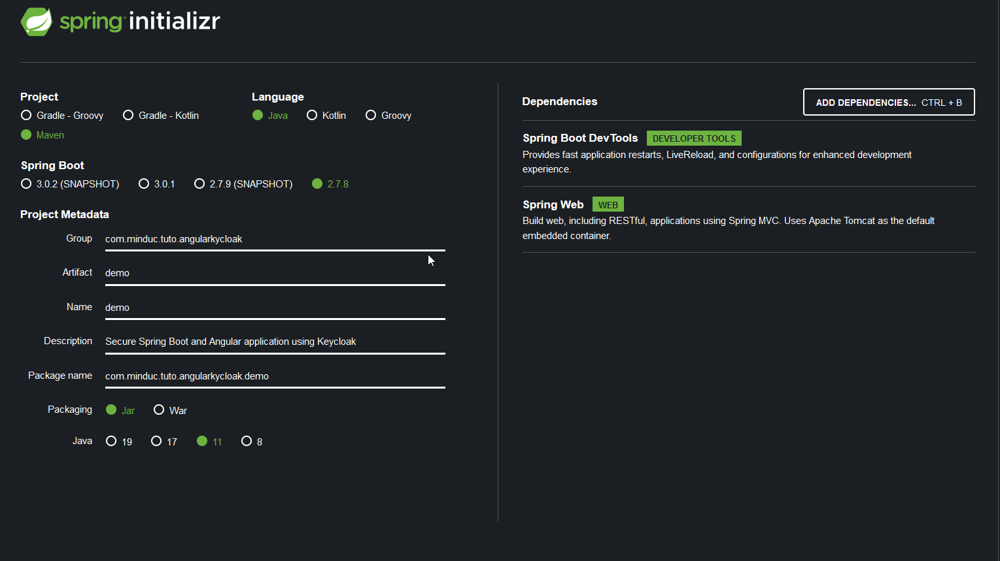
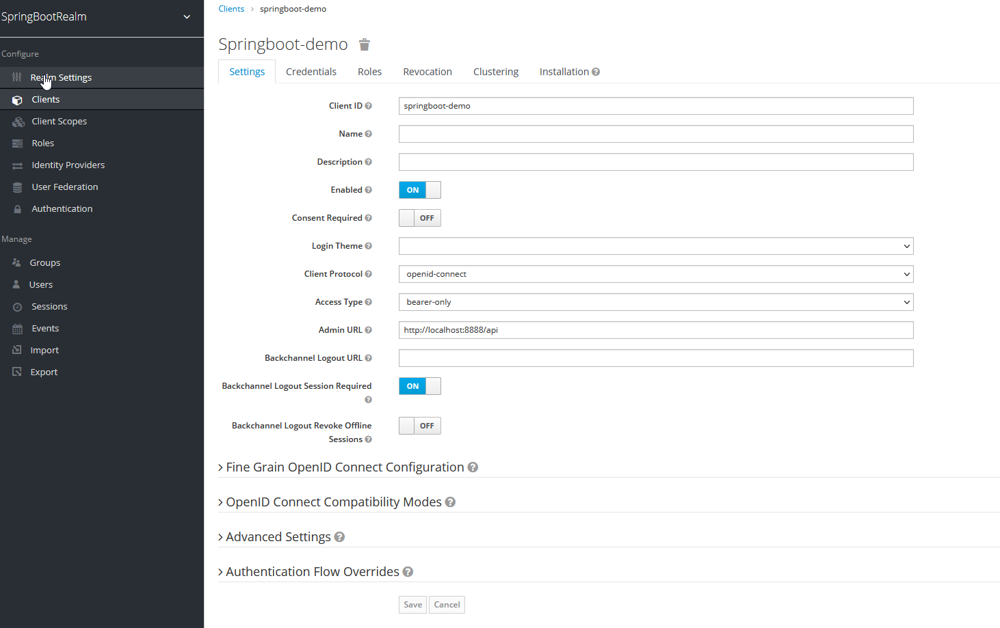

This is a demestration of springboot, keycloak and angular
############### Start project ##############
1. keycloak 13.01.1: bin\standalone.bat
    http://localhost:8080
2. Angular: npm start
    http://localhost:4200
3. Server: start spring boot app
   server source SpringBootAngularKeycloakBackend at springboot repository
   https://github.com/vampir301285/SpringBoot/tree/master/SpringBootAngularKeycloakBackend
4. login data:
user - user
manager - manager
admin - admin

################ Development ###############################

### Keycloak installation
1. install keycloak:
- download from: https://www.keycloak.org/downloads
- start keycloak: http://localhost:8080/
- go to "Administration Console" and add a realm
- create a new client 'angular-demo' - take a look at picture: keycloak-client.png

### Angular Client
1. Integrate Keycloak with angular
- create a new angular project
    ng new keycloak-frontend
- go to working directory 'cd keycloak-frontend' and then let's install dependencies:
   npm install keycloak-angular 
   npm install keycloak-js

   for more information please visit https://www.npmjs.com/package/keycloak-angular
   it it leads to conflict of dependencie, please install a dedicated version for angular 13 as:
   npm install keycloak-angular@10 keycloak-js@18

- To fix the CORS issue add a proxy.config.json file on the top level:
   {
      "/api": {
    "target": "http://localhost:8888/",
    "secure": false
      }
   }

- update package.json and change the start command to :
   "start": "ng serve --proxy-config proxy.conf.json",

- Next update the environment.ts file :
form Angular 15.1: no environments folde is create, but you can add it with: 
   ng g environments

export const environment = {
  production: false,
  serverUrl: '/api',
  keycloak: {
    // Url of the Identity Provider
    issuer: 'http://localhost:8080/auth/',
    // Realm
    realm: 'demo-realm',
    clientId: 'demo-angular',
  },
};

2. setup: to intialize the Keycloak client
 - create utils inside the src folder and create app-init.ts
 - update app.module.ts

3. create auth guard and service
 - create new folder app/auth
 - go to app/auth: create auth guard: ng generate g auth and add content
 - create authe service: ng generate s auth
 

4. Create some components
   ng g c access-denied 
   ng g c admin 
   ng g c manager

5. add path to app-roungting.module
6. implelement the app.copmponent.html and app.component.ts

7. in cse if you want to project only resources from unauthorization, please enbale check-sso
  updaetw app-init.ts as:

  initOptions: {
            //   This is an action we specified on keycloak load
            //   We have two options : 'login-required'|'check-sso'
            //   If is set to 'login-required' this means your browser will do a full redirect to the Keycloak server and back to your application.
            //   If is set to  'check-sso'  instead this action will be performed in a hidden iframe, so your application resources only need to be loaded and parsed once by the browser.
            //   Then you will need to add the silentCheckSsoRedirectUri and create a html file   silent-check-sso.html with this content
            // <html>
            //    <body>
            //         
            //      </body>
            // </html>
            onLoad: 'check-sso',
            checkLoginIframe: true,
            silentCheckSsoRedirectUri: window.location.origin + '/assets/silent-check-sso.html',

### Springboot Server
1. create a new spring boot app from https://start.spring.io

2. add keycloak dependency
3. let's create a new client from backend
 - client id: springboot-demo
 - client-protocol: openid-connect
 - Root URL: http://localhost:8888/api
 - access type: bearer-only 

4. create a new RestController.java
5. create new user and role in keycloak
 - go to springboot-demo client and click on roles tab
 - create two new roles: ROLE_ADMIN, ROLE_MANAGER
 - create new users: user (pass: user), manager (pass: manager), admin (pass: admin)
 - click on Role Mappings and assign to coresponding roles
6. let's open webbrowser and try

### Alternative Frontend: OAuth2-Frontend - font end with OAuth2 instaed of Keycloak implementation
1. ng new OAuth2-Frontend
2. add OAuth2.0 dependency: npm install angular-oauth2-oidc@12 --save (for AngularCLI 13)
3. initialie OAthauServcice
4. generate dashboard component

Limitation: no chance to get roles from OAuthSerivce
